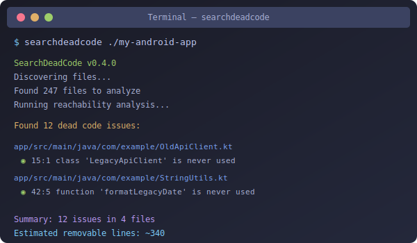

<div align="center">


# SearchDeadCode

**Find and eliminate dead code in Android projects**

[English](README.md) · [简体中文](docs/README.zh-CN.md) · [日本語](docs/README.ja.md) · [한국어](docs/README.ko.md)

[](https://github.com/KevinDoremy/SearchDeadCode/actions/workflows/ci.yml)
[](https://crates.io/crates/searchdeadcode)
[](https://crates.io/crates/searchdeadcode)
[](https://blog.rust-lang.org/2023/06/01/Rust-1.70.0.html)
[](https://github.com/KevinDoremy/homebrew-tap)
[](https://opensource.org/licenses/MIT)

A fast Rust CLI to detect and safely remove dead code in Android projects (Kotlin & Java). Inspired by [Periphery](https://github.com/peripheryapp/periphery) for Swift.

```bash
brew install KevinDoremy/tap/searchdeadcode  # macOS / Linux
cargo install searchdeadcode                  # via Cargo
```



</div>

## Why SearchDeadCode

- **Fast.** Parse 1 000 files in under 1 second; 10 000 files in under 5 seconds.
- **Android-aware.** Activities, Fragments, Compose, AndroidManifest, layout XMLs, DI annotations all auto-retained as entry points.
- **Hybrid analysis.** Combine static analysis with JaCoCo / Kover / LCOV coverage and R8 `usage.txt` for confirmed findings.
- **Safe delete.** Interactive, batch, and dry-run modes, with restore script generation.
- Pairs well with [kotlin-jump](https://github.com/elumine-dev/kotlin-jump) for editor-side navigation.

## Comparison with alternatives

| Feature | SearchDeadCode | Android Lint | R8 / ProGuard | Detekt | IntelliJ |
|---|:---:|:---:|:---:|:---:|:---:|
| Speed | <1s/1k files | Slow | Build-time | Medium | Medium |
| Kotlin-first | ✅ | Partial | ✅ | ✅ | ✅ |
| Java support | ✅ | ✅ | ✅ | ❌ | ✅ |
| Safe delete | ✅ Interactive | ❌ | ❌ | ❌ | IDE only |
| CI / CD ready | ✅ SARIF, JSON | ✅ XML | ❌ | ✅ SARIF | ❌ |
| Coverage integration | ✅ JaCoCo, Kover, LCOV | ❌ | ❌ | ❌ | ❌ |
| Cycle detection | ✅ Zombie code | ❌ | ❌ | ❌ | ❌ |
| Resource detection | ✅ | ✅ | ❌ | ❌ | ✅ |
| Standalone (no build) | ✅ | ❌ | ❌ | ❌ | ❌ |
| License | MIT | Apache | Proprietary | Apache | Proprietary |

**When to reach for each**: SearchDeadCode for fast CI feedback and project audits. Android Lint for broader Android-specific checks. R8 for production-build accuracy. Detekt for style and complexity. IntelliJ for interactive refactoring inside the IDE.

## Quick start

```bash
# Analyze your Android project
searchdeadcode ./my-android-app

# Preview what would be deleted (no changes)
searchdeadcode ./my-android-app --delete --dry-run

# High-confidence findings only
searchdeadcode ./my-android-app --min-confidence high
```

### Sample output

```
$ searchdeadcode ./my-app --min-confidence high

SearchDeadCode v0.4.0
Found 247 files to analyze
Reachability: 1 847 reachable, 2 103 total

Found 12 dead code issues:

Confidence Legend:
  ● Confirmed (runtime)  ◉ High  ○ Medium  ◌ Low

app/src/main/java/com/example/data/OldApiClient.kt
  ◉ 15:1 warning [DC001] class 'LegacyApiClient' is never used

app/src/main/java/com/example/utils/StringUtils.kt
  ◉ 42:5 warning [DC001] function 'formatLegacyDate' is never used
  ◉ 67:5 warning [DC001] function 'parseOldFormat' is never used

Summary: 12 issues in 4 files (3 classes, 5 functions, 4 properties)
Estimated removable lines: ~340
```

## Detection capabilities

| Category | Detected |
|---|---|
| Core | Unused classes, interfaces, methods, functions, properties, fields, imports |
| Advanced | Unused parameters, enum cases, type aliases |
| Smart | Assign-only properties, dead branches, redundant public modifiers |
| Android | Activities, Fragments, XML layouts, AndroidManifest entries (auto-retained) |
| Resources | Unused strings, colors, dimens, styles, attrs |

Full reference and code examples for each detector: [`docs/detectors.md`](docs/detectors.md).

## Installation

### Homebrew (macOS / Linux)

```bash
brew tap KevinDoremy/tap
brew install searchdeadcode
```

### Cargo

```bash
cargo install searchdeadcode
```

### Pre-built binaries

Download from [GitHub Releases](https://github.com/KevinDoremy/SearchDeadCode/releases). Available for Linux x86_64/aarch64, macOS Intel/Apple Silicon, Windows x86_64.

> macOS may quarantine the binary. Run `xattr -d com.apple.quarantine ~/Downloads/searchdeadcode-macos-*` then `chmod +x` it. More options in [`docs/troubleshooting.md`](docs/troubleshooting.md).

### From source

```bash
git clone https://github.com/KevinDoremy/SearchDeadCode
cd SearchDeadCode
cargo install --path .
```

## Usage essentials

```bash
# Basic analysis
searchdeadcode ./app

# JSON output for programmatic use
searchdeadcode ./app --format json --output report.json

# SARIF for GitHub Code Scanning
searchdeadcode ./app --format sarif --output report.sarif

# Hybrid analysis with coverage + R8 usage
searchdeadcode ./app \
  --coverage build/reports/jacoco/test/jacocoTestReport.xml \
  --proguard-usage app/build/outputs/mapping/release/usage.txt \
  --detect-cycles \
  --min-confidence high

# Safe delete with dry-run
searchdeadcode ./app --delete --dry-run
```

Power features: hybrid coverage analysis, R8 / ProGuard integration, zombie code detection, watch mode, baseline support, unused resources, unused params. See [`docs/cli-reference.md`](docs/cli-reference.md) for the full CLI reference and [`docs/hybrid-analysis.md`](docs/hybrid-analysis.md) for coverage + R8 workflows.

## CI integration (GitHub Actions)

```yaml
# .github/workflows/dead-code.yml
name: Dead Code Detection

on: [push, pull_request]

jobs:
  dead-code:
    runs-on: ubuntu-latest
    steps:
      - uses: actions/checkout@v4

      - name: Detect Dead Code
        uses: KevinDoremy/SearchDeadCode@v0
        with:
          path: '.'
          format: 'sarif'
          output: 'deadcode.sarif'
          min-confidence: 'high'
          fail-on-findings: 'true'

      - name: Upload SARIF
        uses: github/codeql-action/upload-sarif@v2
        with:
          sarif_file: deadcode.sarif
```

GitLab CI, Bitbucket, and pre-commit hook examples in [`docs/ci-integration.md`](docs/ci-integration.md).

## Configuration

SearchDeadCode looks for `.deadcode.yml`, `.deadcode.toml`, or a path passed via `--config`. Minimal example:

```yaml
# .deadcode.yml
targets:
  - "app/src/main/kotlin"
  - "app/src/main/java"

exclude:
  - "**/generated/**"
  - "**/build/**"
  - "**/test/**"

retain_patterns:
  - "*Adapter"
  - "*ViewHolder"
  - "*Binding"

android:
  parse_manifest: true
  parse_layouts: true
  auto_retain_components: true
```

Full schema (YAML + TOML) and Android-specific options: [`docs/configuration.md`](docs/configuration.md).

## When NOT to use SearchDeadCode

Being honest about limits helps you pick the right tool. Skip SearchDeadCode if:

- **You need 100% accuracy.** Static analysis cannot catch reflection or runtime-only references. Validate against R8 `usage.txt` instead, or pass it via `--proguard-usage`.
- **Heavy reflection.** Code accessed via `Class.forName()` looks unused. Workaround: add reflection targets to `retain_patterns`.
- **Pure Java projects.** SearchDeadCode is Kotlin-first. Java works but [UCDetector](https://ucdetector.org/) or IntelliJ inspections may fit better.
- **You want IDE integration.** This is a CLI. Use IntelliJ / Android Studio's "Unused declaration" inspection, or run SearchDeadCode in `--watch` mode alongside.
- **Dynamic targets (KMP JS).** We analyze JVM bytecode patterns. JavaScript and other dynamic targets are out of scope.

But you'll likely want SearchDeadCode if you need: speed, CI integration, safe deletion with undo, hybrid coverage analysis, or no-build-required audits.

## Documentation

- [`docs/detectors.md`](docs/detectors.md) — 9 detection types with code examples
- [`docs/cli-reference.md`](docs/cli-reference.md) — full CLI reference and command examples
- [`docs/configuration.md`](docs/configuration.md) — YAML and TOML schemas
- [`docs/hybrid-analysis.md`](docs/hybrid-analysis.md) — coverage, R8 / ProGuard, zombie code
- [`docs/ci-integration.md`](docs/ci-integration.md) — GitHub Actions, GitLab, pre-commit hooks
- [`docs/troubleshooting.md`](docs/troubleshooting.md) — Gatekeeper, FAQ, known limitations
- [`docs/architecture.md`](docs/architecture.md) — pipeline, tech stack, project structure, performance targets
- [`docs/research.md`](docs/research.md) — dead code detection paradigms (Periphery, Meta SCARF, R8, tree shaking)
- [`docs/roadmap.md`](docs/roadmap.md) — 40 advanced patterns prioritized for future detectors
- [`CHANGELOG.md`](CHANGELOG.md) — full version history

## Contributing

Contributions welcome. See [`AGENTS.md`](AGENTS.md) for the full contributor guide and [`CONTRIBUTING.md`](CONTRIBUTING.md) for the dev setup.

Good first issues: add new annotation patterns to `entry_points.rs`, improve XML parsing for additional attributes, write fixtures for edge cases.

## Companion tools

- [kotlin-jump](https://github.com/elumine-dev/kotlin-jump) — VS Code Kotlin/Java navigation, no JVM (4.6k+ installs).
- [detekt-lsp](https://github.com/elumine-dev/detekt-lsp) — Live Detekt diagnostics for any LSP editor (pre-alpha).
- SearchDeadCode — this project.

Maintained alongside [elumine-dev](https://github.com/elumine-dev) by [Kevin Doremy](https://kevindoremy.com).

## License

[MIT](LICENSE) © Kevin Doremy Laferrière
