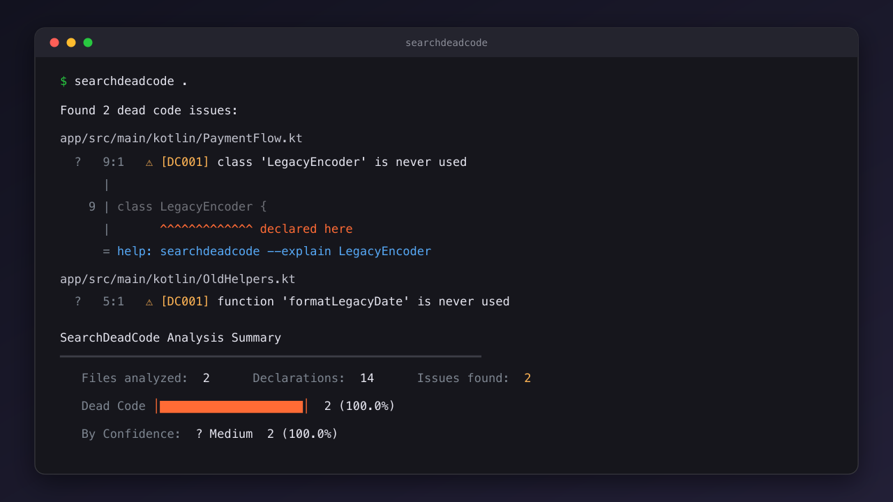
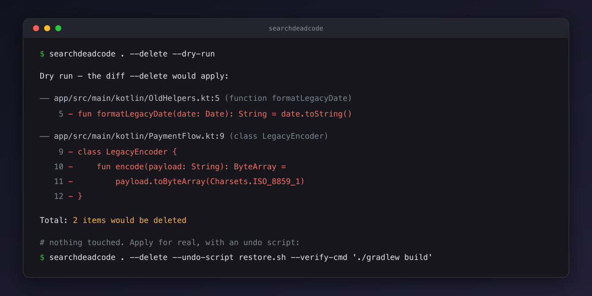
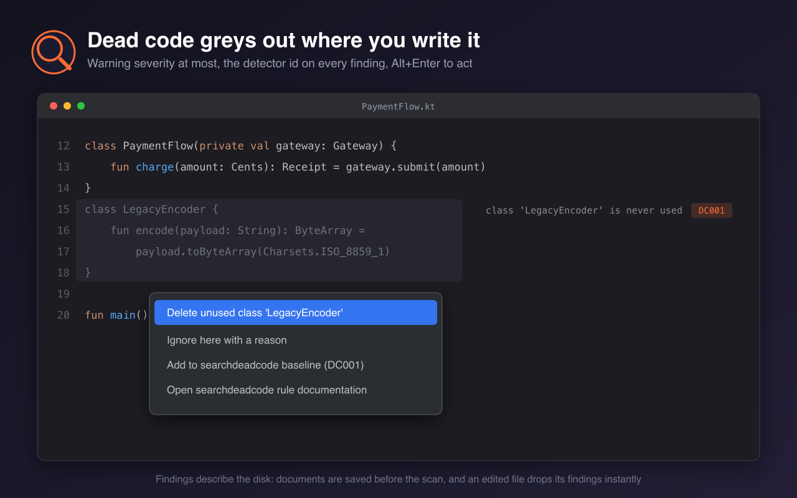
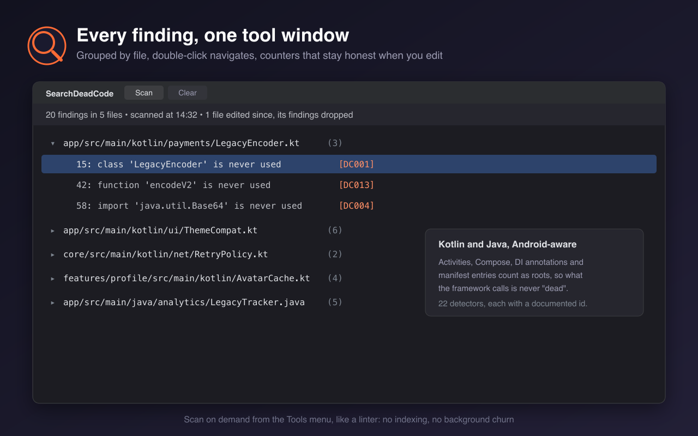
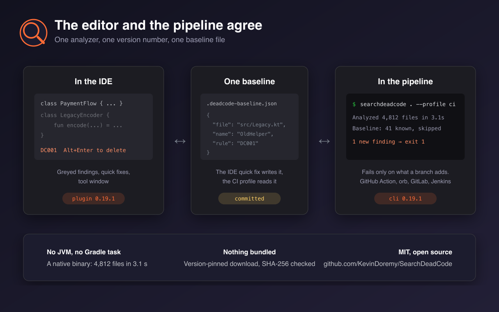

# SearchDeadCode

<p align="center">
  
</p>

<p align="center">
  <strong>Your app ships dead code. Find it, prove it, delete it.</strong><br/>
  Static scan. Runtime proof. Safe delete.<br/>
  No JDK. No Gradle build.
</p>

<p align="center">
  <a href="https://github.com/KevinDoremy/SearchDeadCode/actions/workflows/ci.yml"></a>
  <a href="https://crates.io/crates/searchdeadcode"></a>
  <a href="https://github.com/KevinDoremy/SearchDeadCode/releases"></a>
  <a href="LICENSE"></a>
</p>

<p align="center">
  ⚡ <b>an 800-file module in 1.3 s</b> &nbsp;•&nbsp; 🔍 <b>54 detectors</b> &nbsp;•&nbsp; 📦 <b>one binary, zero build</b>
</p>

<p align="center">
  <b>Scan → Review → Delete.</b>
</p>

<p align="center">
  <a href="#install"></a>
  &nbsp;
  <a href="#ide"></a>
</p>

<p align="center">
  <sub>English · <a href="docs/README.zh-CN.md">简体中文</a> · <a href="docs/README.ja.md">日本語</a> · <a href="docs/README.ko.md">한국어</a></sub>
</p>

---

## Why this feels different

Most dead code tools want your build first. A JDK, a Gradle sync, minutes of waiting. SearchDeadCode parses Kotlin and Java sources directly, in Rust. Point it at a bare checkout: a module answers in about a second, a 5,700-file monorepo in under three minutes.

No warmup. No indexing.

---

<a id="install"></a>
## Install

```bash
brew install KevinDoremy/tap/searchdeadcode   # macOS / Linux
cargo install searchdeadcode                  # anywhere with Rust
```

One static binary. Windows, the one-line CI installer and pre-built binaries: [docs/install.md](docs/install.md).

---

## Recent

- **In your IDE.** The Android Studio / IntelliJ plugin ships: greyed-out declarations, quick fixes on Alt+Enter, one version number with the CLI.
- **One-flag CI.** `--profile ci` gates the build, skips the cache and reads your committed baseline.
- **Triage tools.** `--clusters` groups findings that die together; `--kill-list OldCheckout` answers "what falls if I delete this?"
- **Migration radar.** `--twins` and `--compare "old=new"` line up V1/V2 trees and name the blockers.

[Full changelog →](CHANGELOG.md)

---

## One command

```text
$ searchdeadcode .

Found 2 dead code issues:

Confidence Legend:
  ✓ Confirmed (runtime)  ! High  ? Medium  ~ Low

app/src/main/kotlin/PaymentFlow.kt
  ?     9:1   ⚠ [DC001] class 'LegacyEncoder' is never used
      |
    9 | class LegacyEncoder {
      |       ^^^^^^^^^^^^^ declared here
      = help: searchdeadcode --explain LegacyEncoder
```

Run it at the repo root. Every finding shows the declaration itself, then prints the exact command that justifies the verdict. That `help:` line is not documentation. It is your next move.

Copy it. Dig in.

---

## Safe delete

<p align="center">
  
</p>

`--delete --dry-run` shows every removal as a diff and touches nothing. The real delete takes `--undo-script restore.sh`, and `--verify-cmd './gradlew build'` restores every byte if the build breaks.

Wrong call? Everything comes back.

---

## Trust before deleting

```text
$ searchdeadcode . --explain LegacyEncoder

🔎 Explain: com.example.checkout.LegacyEncoder (Class) · PaymentFlow.kt:9
   Incoming references: 0
   Roots checked:
     - entry point (manifest, layouts, annotations, inheritance): no
     - reachable from an entry point: no
   Verdict: DEAD
```

Every verdict is a graph walk you can replay. `--why-alive` answers the inverse: what keeps a symbol alive.

No black box.

---

<a id="ide"></a>
## In your IDE

<p align="center">
  
</p>

The JetBrains plugin is the same analyzer in the editor loop. Dead declarations grey out as you read. Alt+Enter offers four fixes: delete, ignore with a reason, add to baseline, open the rule docs.

<p align="center">
  
</p>

The tool window groups findings by file; double-click navigates. Android Studio Ladybug and newer: [docs/android-studio.md](docs/android-studio.md). Also on [VS Code](https://marketplace.visualstudio.com/items?itemName=elumine.searchdeadcode) and [Open VSX](https://open-vsx.org/extension/elumine/searchdeadcode).

---

## In CI

```yaml
- uses: KevinDoremy/SearchDeadCode@v0
  with:
    args: '--profile ci'
```

`--profile ci` is the whole gate in one flag: exit 1 on findings, zero cache left behind, the committed baseline honored. Adopting on a legacy codebase? Freeze the debt once with `--generate-baseline` and commit the file. From then on the build fails only on what a branch adds.

<p align="center">
  
</p>

Eight platforms, SARIF, Checkstyle and exit codes: [docs/ci-integration.md](docs/ci-integration.md).

---

## Confirmed, not guessed

```bash
searchdeadcode . \
  --coverage build/reports/jacoco/test/jacocoTestReport.xml \
  --proguard-usage app/build/outputs/mapping/release/usage.txt
```

Static analysis says probably. Runtime evidence says confirmed. Feed it JaCoCo, Kover or LCOV coverage plus R8's `usage.txt`; findings both sources agree on get promoted to ✓ Confirmed.

Delete without ceremony.

---

## What it detects

Fifty-four detectors. Twenty-two hunt dead code: unused classes, methods, properties, imports, parameters, enum cases, XML resources. Thirty-two flag anti-patterns across Kotlin, Compose, performance and architecture. Activities, Fragments, manifest components and DI annotations are auto-retained, so framework wiring never shows up as noise.

Every rule, with code samples: [DETECTORS.md](DETECTORS.md).

---

## Configuration

Zero config to start. When reflection or codegen fools the graph, one file sets the record:

```yaml
# .deadcode.yml
retain_patterns:
  - "*Adapter"
  - "*ViewHolder"
```

Full schema, YAML and TOML, plus the Android options: [docs/configuration.md](docs/configuration.md).

---

## Not the right tool when

- You need 100 % certainty: static analysis cannot see `Class.forName()`. Pass R8's `usage.txt` instead.
- Your project is pure Java: it works, but Kotlin comes first here.
- You target KMP JS: out of scope.
- You want analysis on every keystroke: scans are on demand, like a linter.

The honest feature-by-feature table: [docs/comparison.md](docs/comparison.md).

---

## Like it?

If it cleared real weight from your app, a GitHub star helps other Android teams find this. Bugs and ideas land as [issues](https://github.com/KevinDoremy/SearchDeadCode/issues).

### Companion tools

- [kotlin-jump](https://github.com/elumine-dev/kotlin-jump): Kotlin and Java navigation for VS Code, no JVM.
- [detekt-lsp](https://github.com/elumine-dev/detekt-lsp): live Detekt diagnostics for any LSP editor.

Maintained alongside [elumine-dev](https://github.com/elumine-dev) by [Kevin Doremy](https://kevindoremy.com).

[MIT](LICENSE). Take it anywhere.
